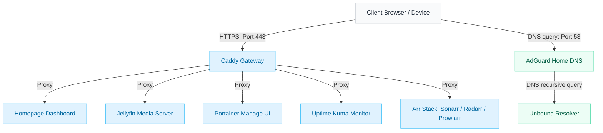

# Homelab Configuration & Services

This repository contains the infrastructure-as-code and container configurations for provisioning and running my personal homelab.

```txt
    __          __  __      __
   / /_  ____ _/ /_/ /___ _/ /_
  / __ \/ __ `/ __/ / __ `/ __ \
 / /_/ / /_/ / /_/ / /_/ / /_/ /
/_.___/\__,_/\__/_/\__,_/_.___/
```

---

## Server Architecture Overview

All services run inside isolated Docker containers on a headless Debian server. **Caddy** acts as the central gateway, handling SSL certificates and reverse-proxying incoming local traffic to their respective containers.



---

## Directory Structure

This repo is **config-only**. One folder per stack under `compose/`, plus docs and guardrails at the root.

* **`compose/`** — Declarative service definitions; the only thing deployed to the server (symlinked to `/srv/docker-compose`).
  - `caddy/` — Reverse-proxy Caddyfiles.
  - `unbound/`, `adguardhome/` — Recursive DNS resolver + network ad-blocking.
  - `arr/` — VPN-routed download stack: Gluetun + qBittorrent + Sonarr/Radarr/Lidarr/Readarr/Prowlarr/Bazarr/Recyclarr/FlareSolverr.
  - `homepage/`, `jellyfin/`, `portainer/`, … — one compose file (and its `conf/`) per service.
  - `.env.example` — shared env template; the real `.env` is gitignored.
* **`Makefile`** — `make up` / `down` / `pull` / `logs STACK=<name>` wrappers so you never hand-type `-f` paths.
* **Runtime data** lives off-repo on the server at `/mnt/docker-volumes` (DBs, TLS keys, VPN state) and is backed up via **Restic** in [batdots](https://github.com/el-amine-404/batdots) — see [BACKUP.md](./BACKUP.md).

---

## Secrets & Safety

This repo is **config-only** — it must never contain a secret.

* **Real secrets** (WireGuard key, DB password) live in `compose/.env`, which is gitignored. Only `.env.example` (placeholders) is tracked.
* **Runtime state** (databases, TLS keys, VPN state) lives off-repo at `/mnt/docker-volumes` on the server, never in git.
* **Guardrails** stop accidental leaks before they happen:
  - `.gitignore` ignores `.env`, `mnt/`, and any `*.key` / `*.pem` / `*.crt` material.
  - `pre-commit` runs **gitleaks** + `detect-private-key` + a large-file guard on every commit.
  - A GitHub Actions workflow (`secret-scan`) re-scans on every push as a backstop.

Enable the local hooks once after cloning:

```bash
pip install pre-commit   # or: brew install pre-commit
pre-commit install
pre-commit run --all-files
```

See [BACKUP.md](./BACKUP.md) for how the gitignored data is protected and restored with Restic.

---

## Core Hosted Services

| Service          | Port         | Description                                                       |
| :--------------- | :----------- | :---------------------------------------------------------------- |
| **Caddy**        | `80` / `443` | Reverse proxy with automatic TLS/HTTPS certificates.              |
| **AdGuard Home** | `53`         | Network-wide DNS server and ad/tracker blocker.                   |
| **Unbound**      | `53`         | Recursive DNS resolver for privacy and validation.                |
| **Homepage**     | `3888`       | Application startpage with real-time docker widgets.              |
| **Jellyfin**     | `8096`       | High-performance open-source media streaming server.              |
| **qBittorrent**  | `8080`       | BitTorrent downloader client.                                     |
| **Arr Stack**    | Various      | Sonarr, Radarr, Lidarr, Readarr, Prowlarr, Bazarr, and Recyclarr. |
| **Uptime Kuma**  | `3001`       | Service monitoring and custom status pages.                       |
| **Portainer**    | `9443`       | Web UI for managing containers and stacks.                        |
| **Netdata**      | `19999`      | Real-time container and host health monitor.                      |

---

## Installation & Deployment Guide

For full instruction on how to set up the server directory structure, configure environment secrets, and spin up the docker containers, see the dedicated [Installation Guide](./INSTALL.md).
